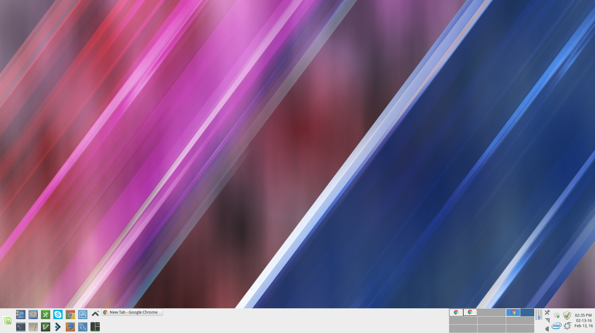
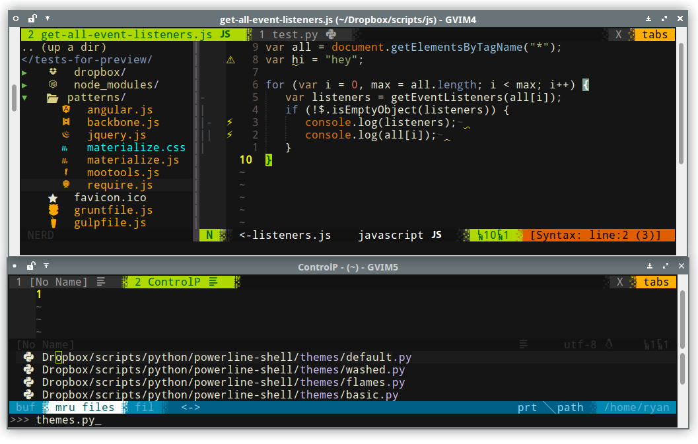
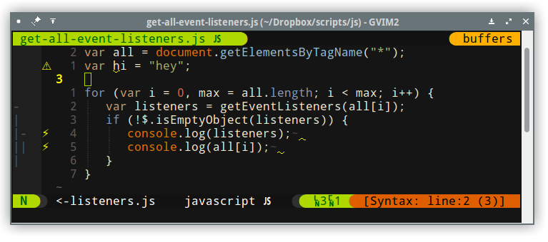
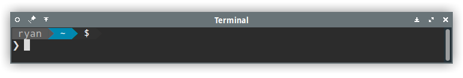

# Settings Previews

> screenshots, backup, and overview of my dev settings for my own reference. If it's useful to others then that's cool


## Desktop



## Vim configuration

### Custom font and glyphs



* Showing
  * file type glyphs from [vim-devicons][vim-devicons]
  * font from [nerd-fonts][nerd-fonts]

### JavaScript development



* Showing
  * custom separators and column number glyphs from [powerline-extra-symbols][powerline-extra-symbols]
  * file type glyphs from [vim-devicons][vim-devicons]
  * custom [syntastic][syntastic] glyphs
  ```vim
    let g:syntastic_style_error_symbol = '⚡'
    let g:syntastic_error_symbol = '✗'
    let g:syntastic_warning_symbol = '⚠'
  ```
  * [JSCS][jscs]
  * [JSHint][jshint]
* Vim JS development related plugins in use
  * [Syntastic][syntastic]
  * [JSDoc.vim][vim-jsdoc]

## Terminal



* Showing [Milkbikis' Powerline Shell][powerline-shell]

### Bash Aliases

* git branch
  * `gb`
* git commit -a -m
  * `gcam`
* git checkout
  * `gco`
* git pull
  * `gp`
* git rev-parse HEAD | cut -c -7
  * `grev`
* git status
  * `gs`
* git fetch pull
  * `gfpull`
* git fetch push
  * `gfpush`
* git track (create new tracking branch)
  * `gt`
* git version (tag and branch at a specific deploy point)
  * `gv`

## Tmux

* todo

[vim-devicons]:https://github.com/ryanoasis/vim-devicons
[powerline-extra-symbols]:https://github.com/ryanoasis/powerline-extra-symbols
[syntastic]:https://github.com/scrooloose/syntastic
[jscs]:https://github.com/jscs-dev/node-jscs
[jshint]:https://github.com/jshint/jshint
[vim-jsdoc]:https://github.com/heavenshell/vim-jsdoc
[powerline-shell]:https://github.com/milkbikis/powerline-shell
[nerd-fonts]:https://github.com/ryanoasis/nerd-fonts
